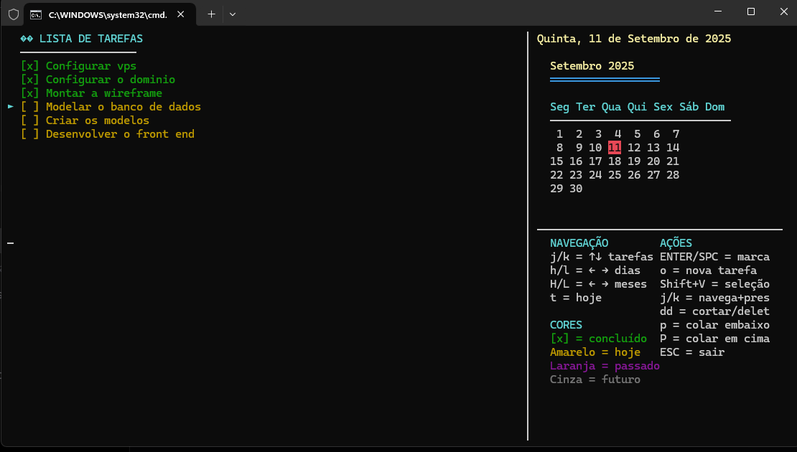

# TaskFast

Um aplicativo de lista de tarefas interativo para terminal, desenvolvido em Python com interface curses.



## Características

- ✅ Interface visual moderna no terminal
- 📅 Navegação por datas com calendário integrado
- 🎯 Seleção múltipla de tarefas
- 📊 Histórico de tarefas concluídas
- ⏰ Indicação de tempo relativo (tarefas do passado/futuro)
- 🎨 Interface colorida com códigos visuais
- 💾 Persistência automática de dados

## Como usar

### Navegação

- `j/k` - Navegar entre tarefas (↑↓)
- `h/l` - Navegar entre dias (←→)
- `H/L` - Navegar entre meses
- `t` - Voltar para hoje

### Ações com tarefas

- `ENTER` ou `SPACE` - Marcar/desmarcar como concluída
- `o` - Criar nova tarefa
- `dd` - Cortar/deletar tarefa
- `p` - Colar tarefa embaixo
- `P` - Colar tarefa em cima

### Seleção múltipla

- `Shift+V` - Ativar modo seleção múltipla
- `j/k` - Navegar e pré-selecionar tarefas
- `ENTER` ou `SPACE` - Aplicar ação às tarefas selecionadas

## Instalação

### Executável (recomendado)

Baixe o executável `TaskFast.exe` da seção de releases.

### A partir do código fonte

```bash
pip install -r requirements.txt
python taskfast.py
```

### Compilar executável

```bash
pip install pyinstaller
pyinstaller TaskFast.spec
```

## Cores e indicadores

- 🟢 **Verde** - Tarefa concluída
- 🟡 **Amarelo** - Tarefa de hoje
- 🟣 **Magenta** - Tarefa do passado (atrasada)
- ⚫ **Cinza escuro** - Tarefa agendada para o futuro

## Arquivos de dados

- `checklist_historico.json` - Histórico de tarefas concluídas
- `checklist_pendentes.json` - Tarefas pendentes

## Requisitos

- Python 3.6+
- Módulo `curses` (incluído na instalação padrão do Python no Linux/macOS)
- No Windows, usar Windows Terminal ou Prompt de Comando

## Licença

Este projeto está sob a licença MIT.
